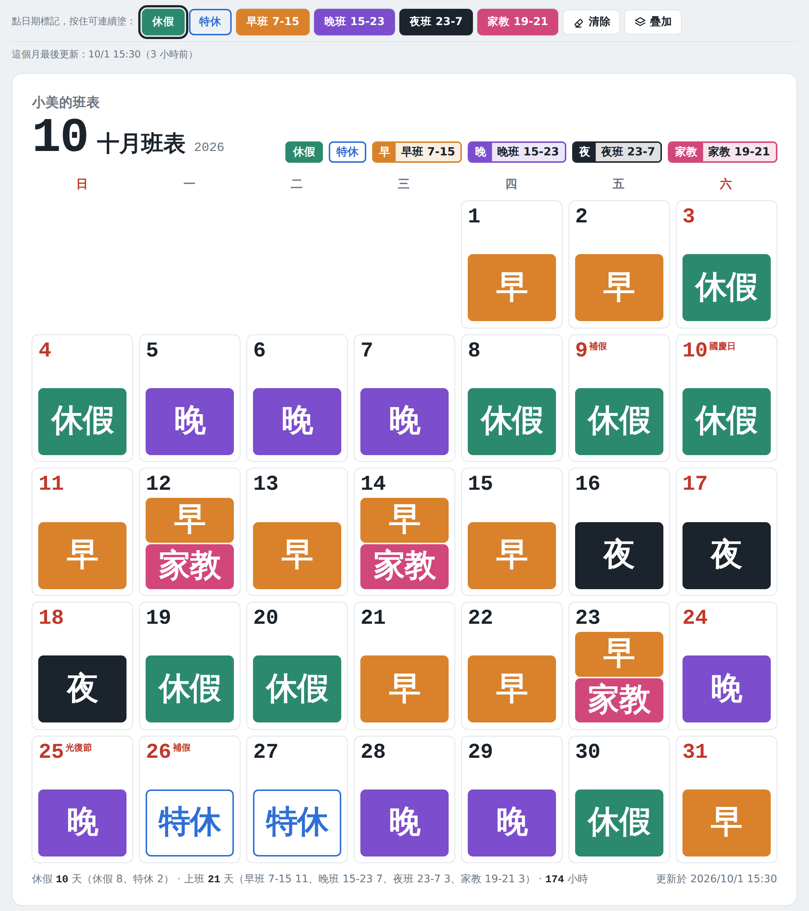
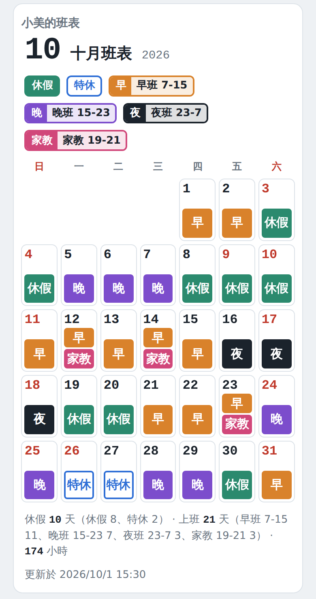
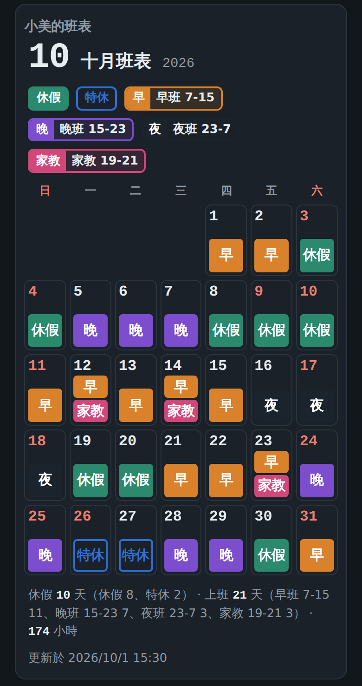

# 班表

可以自訂標籤的月曆班表，排休、排班、值班都能用。點日期或按住連續塗來標記，也可以用文字一次貼上整個月，最後產生圖片傳到群組，或匯出成日曆檔加進手機行事曆。

**👉 開始使用：https://roster.chika.cc/**

<p align="center">
  
</p>
<p align="center">
  
  
</p>

## 功能

- **選月份**：點月份標題可以直接選年份和月份，也可以輸入 `2027/3`。
- **點選或連續塗**：在上方選一個標籤，點日期就能標記；手機按住 0.3 秒再滑動、電腦按住滑鼠拖曳，可以一次塗好幾天。
- **一天多個班**：開啟「疊加」後，點日期會把標籤加上去，分段班、半天假加半天班都能標。
- **文字輸入**：用文字一次貼上一個或好幾個月，「以標籤為主」或「以日期為主」都可以；也能把目前的月份複製成文字傳到 LINE。
- **復原上一步**：點錯、塗錯、套用錯了，都可以復原上一步（包含一次套用好幾個月）。
- **自訂標籤**：名稱、顯示名稱、顏色、類型（休假／上班）、顯示方式（實心／空心／隱藏）、順序都能改，數量沒有上限。順序可以在標記工具列按住拖曳調整。每個月各自一份，新的月份會沿用最近一個月的設定。
- **標籤的時間**：名稱像 `9-18`、`22-6`（跨日）、`18-26`（30 小時制）會自動判斷時間，也可以自己填；跨日的班可以選算在開始或結束那天。時間用在時數統計和日曆檔。
- **沒填時的預設**：沒標的日子可以是「上班」也可以是「休假」，看你習慣標哪一種比較省事。
- **國定假日**：放假日的日期會變紅並寫上名稱（太長的名稱用常見簡稱，例如「光復節」），補班日寫「補班」，只是提示、不影響標記。資料來自行政院人事行政總處的辦公日曆表，每月自動更新。
- **其他節日**（預設關閉）：情人節、母親節、復活節、元宵節、七夕、中元節、重陽節、尾牙、冬至、聖誕節等不放假的日子，用灰色小字標示。在瀏覽器裡計算（農曆用瀏覽器內建的農曆），不需要資料檔。
- **隱藏的標籤**：可以完全不顯示、只在編輯時用半透明虛線預覽，或一律用虛線顯示在月曆和圖片上。
- **統計**：自動計算休假、上班天數和時數，多種假別或班別會分開列出；有設時間的假也會算出請假時數。
- **版面**：每格顯示幾個標籤（預設自動）、標籤和日期的大小、標籤要不要加高補滿空位都能調；超過的標籤會標示「+1」並列在月曆下方。
- **產生圖片**：先預覽圖片再決定怎麼送出。電腦可以下載（PNG）、複製後直接貼到 LINE 或聊天視窗、列印，瀏覽器支援時也能用系統分享；手機可以用系統分享，或長按圖片存到相簿。
- **圖片設定**：在產生圖片的畫面裡設定班表名稱、要不要顯示名稱、更新時間和時數、淺色或深色圖片、橫式或直式、解析度，以及檔名。列印的紙張方向跟著橫式或直式。檔名預設用班表名稱（沒取名時是 `roster`）加上月份，例如 `roster-2026-10.png`。
- **日曆檔（.ics）**：把班表匯出成日曆檔，加進 Google 日曆、Apple 行事曆或 Outlook；也可以匯入別人給的日曆檔，自動對應成標籤。
- **範例**：內建六種情境（一般上班族、餐飲／零售、輪班制、兼職打工、護理師三班制、深夜營業），可以先看看效果，再把喜歡的標籤套用到自己的月份。
- **淺色／深色**：可以固定，也可以跟隨系統。
- **加到主畫面、離線使用**：開過一次之後，沒有網路也能打開和編輯。

## 文字輸入寫法

兩種排列都看得懂，也可以混著寫：

```
2026年11月
晚班 晚 18-22: 3 5 17-19
特休 空心: 20
1 2 8 9: 休
12: 10-14 18-22
11/26 晚
```

- **以標籤為主**：`名稱: 日期`。名稱後面可以接設定，依寫法自動判斷：時間 `18-22`、`休假`／`上班`、`實心`／`空心`／`隱藏`、色碼 `#d9822b`、`算結束`（跨日班算結束那天）、`預設`（沒填時的預設），其他文字是顯示名稱。設定只要寫一次。
- **以日期為主**：`日期: 標籤`，一天多個班就並排寫。只有一個日期時可以省略冒號，例如 `11/3 早班`。
- 標籤可以用名稱、顯示名稱或時間來寫；都對不到就新增。
- 月份：`2026年11月`、`2026/06`、`2026-11`、`11月`、`十一月`，可以一次寫好幾個月（會先確認）。日期：`3`、`3-5`、`11/3`、`2026/6/3`。
- `11-20: 3 17` 會當成「11-20 這個班在 3、17 號」。日期範圍配時間名稱的標籤時，日期分開寫或標籤加引號：`12 13 14: 18-22`、`12-14: 「18-22」`。
- 有空格的名稱，或想讓「休假」這種字當成顯示名稱時，用引號：`「早 班」`、`"休假"`。
- `休`、`休假`、`排休`、`off` 代表這個月的第一個休假類標籤；沒寫到的日子是「沒填時的預設」；`#` 開頭的行會被略過。
- 舊寫法也看得懂：`4跟18標註11-20`、`11-20 4.18`、只有數字的一行當作休假。
- 產生的文字可以切換「以標籤為主／以日期為主」，也可以勾選「包含標籤設定」，把整套設定一起複製。

## 資料與隱私

- 所有資料只存在你的瀏覽器（localStorage），不會上傳，也沒有任何追蹤或分析程式。匯入的日曆檔也只在瀏覽器裡讀取。
- 不同手機、不同瀏覽器之間的資料不會同步。
- 清除瀏覽器資料、使用無痕模式，或 iPhone Safari 長時間沒有打開，資料都可能被清掉。**請定期用「複製備份」保存**，換手機時用「還原」貼回來即可。

## 自己架設

這是純靜態網頁，沒有建置步驟，放到任何靜態網站空間都能用。

1. Fork 或下載這個 repo。
2. 在 repo 的 **Settings → Pages**，Source 選 **Deploy from a branch**，Branch 選 `main`、資料夾選 `/ (root)`。
3. 等一兩分鐘，網址會是 `https://你的帳號.github.io/repo名稱/`。

所有路徑都是相對路徑，repo 取什麼名字都可以。這個 repo 裡的 `CNAME` 檔案是用來綁定 `roster.chika.cc` 的，fork 後請刪掉或改成你自己的網域。

### 檔案說明

| 檔案 | 用途 |
|---|---|
| `index.html` | 整個工具（介面、樣式、程式） |
| `vendor/` | 產生圖片的程式庫（html2canvas） |
| `manifest.webmanifest`、`icons/` | 加到主畫面用的名稱與圖示 |
| `sw.js` | 離線快取 |
| `holidays.json` | 國定假日與補班日（自動產生，不用手動改） |
| `scripts/update-holidays.mjs`、`.github/workflows/` | 每月從官方辦公日曆表更新 `holidays.json` |
| `docs/` | README 用的截圖 |

### 更新時要注意

- 只改 `index.html`：直接覆蓋即可，使用者下次連網打開就是新版。
- 有換 `vendor/` 或 `icons/` 裡的檔案：把 `sw.js` 裡的 `CACHE = "roster-v1"` 版本號加 1，舊的快取才會被換掉。
- 版本號遵循[語意化版本](https://semver.org/lang/zh-TW/)，記得同步修改 `index.html` 裡的 `VERSION` 和 [CHANGELOG](CHANGELOG.md)。

### 國定假日資料

- `holidays.json` 由 GitHub Actions 每月 1 號自動執行 `scripts/update-holidays.mjs` 產生：下載行政院人事行政總處的「中華民國政府行政機關辦公日曆表」（[政府資料開放平臺](https://data.gov.tw/dataset/14718)），只保留放假日和補班日，有變更才會透過 GitHub API 建立 commit（由 GitHub 簽章，作者是 github-actions[bot]）。
- 也可以在 repo 的 **Actions → Update holiday data → Run workflow** 手動執行。
- 如果自動下載失敗，可以把官方 CSV 放進 `scripts/holidays-csv/` 再執行一次，或用環境變數 `HOLIDAY_CSV_URLS` 指定下載網址。
- 自己架設時，第一次記得手動執行一次，網站才會有國定假日資料。
- 出現超過 7 個字、還沒有簡稱的放假日名稱時，執行紀錄會出現提醒；簡稱表在 `index.html` 的 `HOL_SHORT`。

## 授權

本專案以 [MIT 授權](LICENSE) 釋出。使用的第三方元件與授權請見 [THIRD_PARTY_NOTICES.md](THIRD_PARTY_NOTICES.md)。
